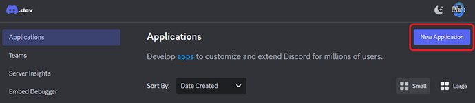
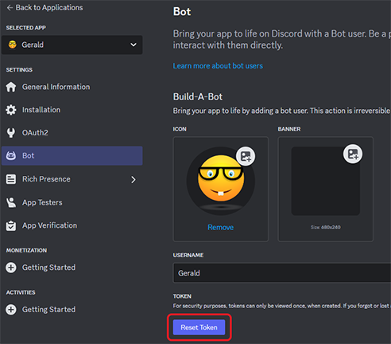
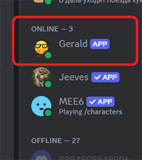

# Setting up your Custom Bot

### Prerequisites

Before we begin please make sure you meet the following requirements;
- [x] Tickety Premium Subscription
- [x] Custom Bot addon Subscription
- [x] Have permissions to invite and add bots to your discord server

### Step 1 Creating your Discord App

Visit the [Discord developer portal](https://discord.com/developers/applications) and click on 'New Application' in the top right corner just under your discord profile icon.

Name your application / bot and agree to the developer terms and conditions before clicking on 'Create' to continue.

### Step 2 Customise your Bot (Optional)

After you have clicked on create you will be in the `General Information` tab of your new application. Here you can give your app (Bot) an icon that be used as its avatar in discord.
You can also give your app a description which is visible to users of your discord when they select or view the profile of your Bot.

### Step 3 App configuration on Discord

Next head to the `Bot` tab in the app configuration and scroll down ensuring each of these are set correctly;
- **Public Bot:** `Disabled`
- **Server Members Intent:** `Enabled`
- **Message Content Intent:** `Enabled`

### Step 4 Configuring your Bot on the Tickety Dash

Don't worry, you are doing great and almost done. Just a couple of more things and your ready to go.

Head to your [Tickety Dashboard](https://tickety.top/dashboard) and head to the `Personalizer` tab for your server. Once there fill out the token info for your Bot.

 

You obtain this info from the [Discord developer portal](https://discord.com/developers/applications) in the `Bot` tab. You will see a button called **Reset Token** click this and copy the token info.

Once you have done this make sure you have the Custom bot enabled on the Tickety Dash and then click the Invite button. After you have done this just check to make sure it is on your discord server, has the permissions and responds and if all is good you can safely remove the Tickety labelled bot.

Congratulations and Enjoy.